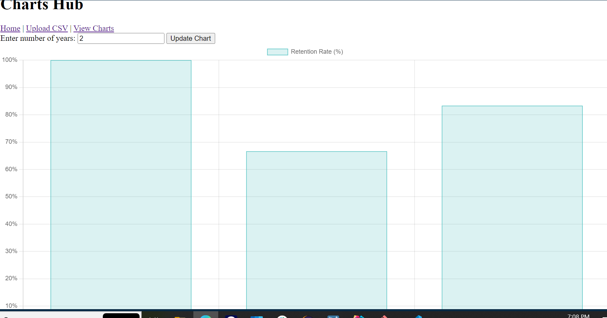

```markdown
# Retention Tracking Application

This is a Spring Boot application for tracking employee retention rates. Users can upload CSV files containing employee data, and the application calculates and displays retention rates for different managers over a specified number of years.

## Features

- **User Registration and Login**: Users can register and log in (to be implemented with Spring Security).
- **CSV Upload**: Users can upload CSV files containing employee data.
- **Data Visualization**: The application calculates retention rates and displays them in a bar chart using Chart.js.

## Technologies Used

- **Backend**: Spring Boot, Spring Data JPA
- **Frontend**: Thymeleaf, Chart.js
- **Database**: MySQL

## Prerequisites

- JDK 17 or higher
- Maven 3.6.3 or higher
- MySQL 8.0 or higher

## Installation

1. Clone the repository:
    ```bash
    git clone https://github.com/RaheemAbol/rTrak.git
    cd rTrak
    ```

2. Set up the MySQL database:
    ```sql
    CREATE DATABASE retentiontrak;
    CREATE USER 'springuser'@'%' IDENTIFIED BY 'ThePassword';
    GRANT ALL PRIVILEGES ON retentiontrak.* TO 'springuser'@'%';
    FLUSH PRIVILEGES;
    ```

3. Update the `application.properties` file with your MySQL configuration:
    ```properties
    spring.datasource.url=jdbc:mysql://localhost:3306/retentiontrak
    spring.datasource.username=springuser
    spring.datasource.password=ThePassword
    spring.jpa.hibernate.ddl-auto=update
    ```

4. Build and run the application:
    ```bash
    mvn clean install
    mvn spring-boot:run
    ```

## Usage

1. Open your web browser and navigate to `http://localhost:8080`.

2. Register and log in (once Spring Security is implemented).

3. Navigate to the CSV upload page, upload a CSV file with employee data.

4. Go to the hub page to view the retention rate charts.

## CSV File Format

The CSV file should have the following columns:
- `id`: Unique identifier for the employee
- `name`: Employee name
- `position`: Employee position
- `manager`: Manager's name
- `hire-date`: Date when the employee was hired (YYYY-MM-DD)
- `exit-date`: Date when the employee left (YYYY-MM-DD), leave blank if the employee is still employed

Example CSV file:
```csv
id,name,position,manager,hire-date,exit-date
1,John Doe,Software Engineer,Alice Smith,2020-01-15,2022-03-01
2,Jane Roe,Product Manager,Bob Johnson,2019-05-20,
3,Richard Roe,QA Engineer,Alice Smith,2021-08-01,2023-01-15
4,Mary Major,UI/UX Designer,Carol King,2018-03-12,2021-11-30
...
```

## Screenshot



This chart shows the retention rates of different managers over the specified number of years.

## Contributing

Contributions are welcome! Please open an issue or submit a pull request for any changes or improvements.

## License

This project is licensed under the MIT License.
```
